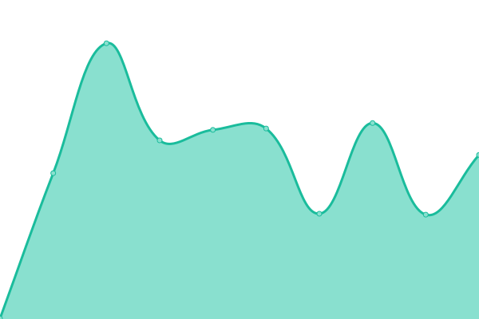
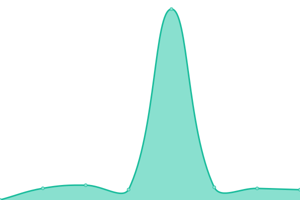

# [📈 Live Status](https://status.seongland.com): <!--live status--> **🟧 Partial outage**

This repository contains the open-source uptime monitor and status page for [Upptime](https://upptime.js.org), powered by [Upptime](https://github.com/upptime/upptime).

With [Upptime](https://upptime.js.org), you can get your own unlimited and free uptime monitor and status page, powered entirely by a GitHub repository. We use [Issues](https://github.com/upptime/upptime/issues) as incident reports, [Actions](https://github.com/upptime/upptime/actions) as uptime monitors, and [Pages](https://status.seongland.com) for the status page.

<!--start: status pages-->
<!-- This summary is generated by Upptime (https://github.com/upptime/upptime) -->
<!-- Do not edit this manually, your changes will be overwritten -->
<!-- prettier-ignore -->
| URL | Status | History | Response Time | Uptime |
| --- | ------ | ------- | ------------- | ------ |
|  [Seongland](https://www.seongland.com) | 🟩 Up | [seongland.yml](https://github.com/seongland/statusland/commits/HEAD/history/seongland.yml) | 

 255ms
     
 | 

<a href="https://status.seongland.com/history/seongland">100.00%</a>
    

|  [Seongland Next](https://next.seongland.com) | 🟩 Up | [seongland-next.yml](https://github.com/seongland/statusland/commits/HEAD/history/seongland-next.yml) | 

 322ms
     
 | 

<a href="https://status.seongland.com/history/seongland-next">100.00%</a>
    

|  [Seongland Account](https://account.seongland.com) | 🟥 Down | [seongland-account.yml](https://github.com/seongland/statusland/commits/HEAD/history/seongland-account.yml) | 

 294ms
     
 | 

<a href="https://status.seongland.com/history/seongland-account">100.00%</a>
    

|  [Pointland](https://point.seongland.com) | 🟩 Up | [pointland.yml](https://github.com/seongland/statusland/commits/HEAD/history/pointland.yml) | 

 190ms
     
 | 

<a href="https://status.seongland.com/history/pointland">100.00%</a>
    

|  [Seongland Live](https://live.seongland.com) | 🟩 Up | [seongland-live.yml](https://github.com/seongland/statusland/commits/HEAD/history/seongland-live.yml) | 

 182ms
     
 | 

<a href="https://status.seongland.com/history/seongland-live">100.00%</a>
    

|  [Seongland Wiki](https://doc.seongland.com) | 🟩 Up | [seongland-wiki.yml](https://github.com/seongland/statusland/commits/HEAD/history/seongland-wiki.yml) | 

 218ms
     
 | 

<a href="https://status.seongland.com/history/seongland-wiki">100.00%</a>
    

<!--end: status pages-->

[**Visit our status website →**](https://status.seongland.com)

## 📄 License

- Powered by: [Upptime](https://github.com/upptime/upptime)
- Code: [MIT](./LICENSE) © [Upptime](https://upptime.js.org)
- Data in the `./history` directory: [Open Database License](https://opendatacommons.org/licenses/odbl/1-0/)
